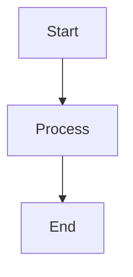

# Enabling GitHub Pages for Documentation

This repository includes a comprehensive MkDocs documentation site that can be automatically deployed to GitHub Pages.

## One-Time Setup

### 1. Enable GitHub Pages

1. Go to your repository on GitHub
2. Click **Settings** → **Pages**
3. Under **Source**, select:
   - **Source**: GitHub Actions
4. Click **Save**

That's it! The documentation will be automatically deployed when you push changes.

### 2. Configure Repository Settings (Optional)

For a custom domain:

1. Go to **Settings** → **Pages**
2. Under **Custom domain**, enter your domain
3. Click **Save**
4. Follow GitHub's instructions to configure DNS

## How It Works

The documentation is automatically built and deployed using GitHub Actions:


## Workflow Details

The workflow (`.github/workflows/docs.yaml`):

1. **Triggers** on:
   - Push to `main` branch
   - Changes to `docs-mkdocs/` directory
   - Manual trigger (`workflow_dispatch`)

2. **Builds** the site:
   - Installs Python and dependencies
   - Runs `mkdocs build`
   - Creates static HTML site

3. **Deploys** to GitHub Pages:
   - Uploads artifact
   - Deploys to Pages environment

## Accessing Documentation

Once enabled, your documentation will be available at:

```
https://<username>.github.io/<repository-name>/
```

For this repository:
```
https://ianlintner.github.io/green_field_cluster/
```

## Local Development

### Install Dependencies

```bash
cd docs-mkdocs
pip install -r requirements.txt
```

### Run Local Server

```bash
mkdocs serve
```

Visit http://localhost:8000 to preview changes.

### Build Locally

```bash
mkdocs build
```

Output will be in `docs-mkdocs/site/` directory.

## Documentation Structure

```
docs-mkdocs/
├── mkdocs.yml              # Configuration
├── requirements.txt        # Python dependencies
└── docs/                   # Markdown content
    ├── index.md           # Home page
    ├── getting-started/   # Getting started guides
    ├── components/        # Component documentation
    ├── deployment/        # Deployment guides
    ├── security/          # Security documentation
    └── development/       # Development guides
```

## Adding New Pages

1. Create a new `.md` file in `docs-mkdocs/docs/`
2. Add it to the navigation in `mkdocs.yml`:

```yaml
nav:
  - Home: index.md
  - Your New Section:
    - Your Page: your-section/your-page.md
```

3. Commit and push - it will be automatically deployed!

## Using Mermaid Diagrams

The documentation supports Mermaid diagrams:

````markdown

````

## Customization

### Theme Colors

Edit `mkdocs.yml`:

```yaml
theme:
  palette:
    primary: indigo  # Change this
    accent: indigo   # And this
```

### Adding Plugins

1. Add to `requirements.txt`:
```
mkdocs-plugin-name==version
```

2. Add to `mkdocs.yml`:
```yaml
plugins:
  - search
  - your-plugin
```

## Troubleshooting

### Documentation not deploying

1. Check **Actions** tab for workflow status
2. Ensure GitHub Pages is enabled in Settings
3. Verify workflow permissions in Settings → Actions

### Build failures

Check workflow logs in **Actions** tab:

```bash
# Or run locally to debug
cd docs-mkdocs
mkdocs build --strict
```

### 404 on GitHub Pages

Wait a few minutes after first deployment. DNS and CDN can take time to propagate.

## Continuous Improvement

The documentation automatically rebuilds when you:

- Update any `.md` file in `docs-mkdocs/docs/`
- Modify `mkdocs.yml`
- Change `requirements.txt`

Just commit and push - GitHub Actions handles the rest!

## Best Practices

1. **Keep it updated**: Update docs with code changes
2. **Use examples**: Include code blocks and diagrams
3. **Link between pages**: Create a connected documentation
4. **Test locally**: Preview before pushing
5. **Use proper markdown**: Follow markdown standards

## Resources

- [MkDocs Documentation](https://www.mkdocs.org/)
- [Material for MkDocs](https://squidfunk.github.io/mkdocs-material/)
- [Mermaid Diagrams](https://mermaid.js.org/)
- [GitHub Pages Documentation](https://docs.github.com/en/pages)
