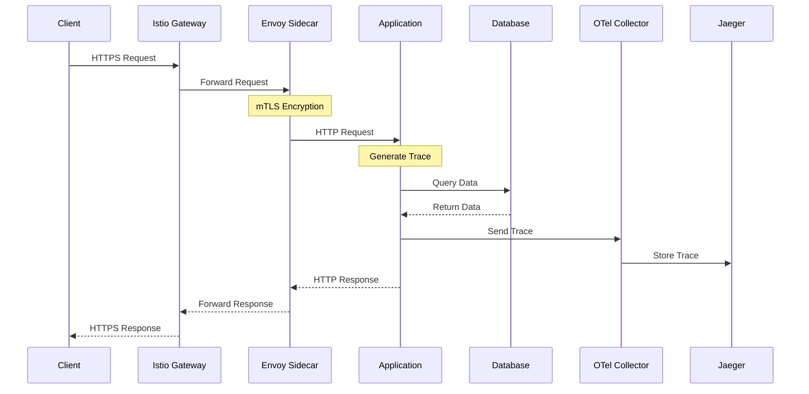
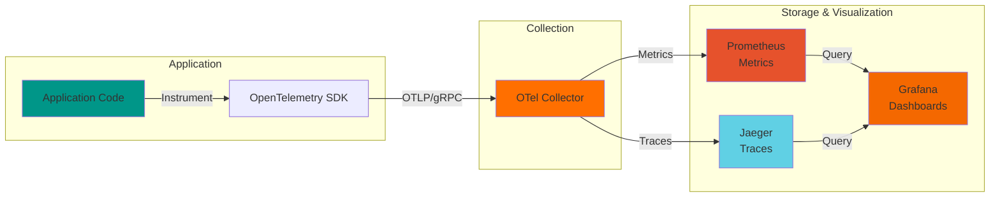
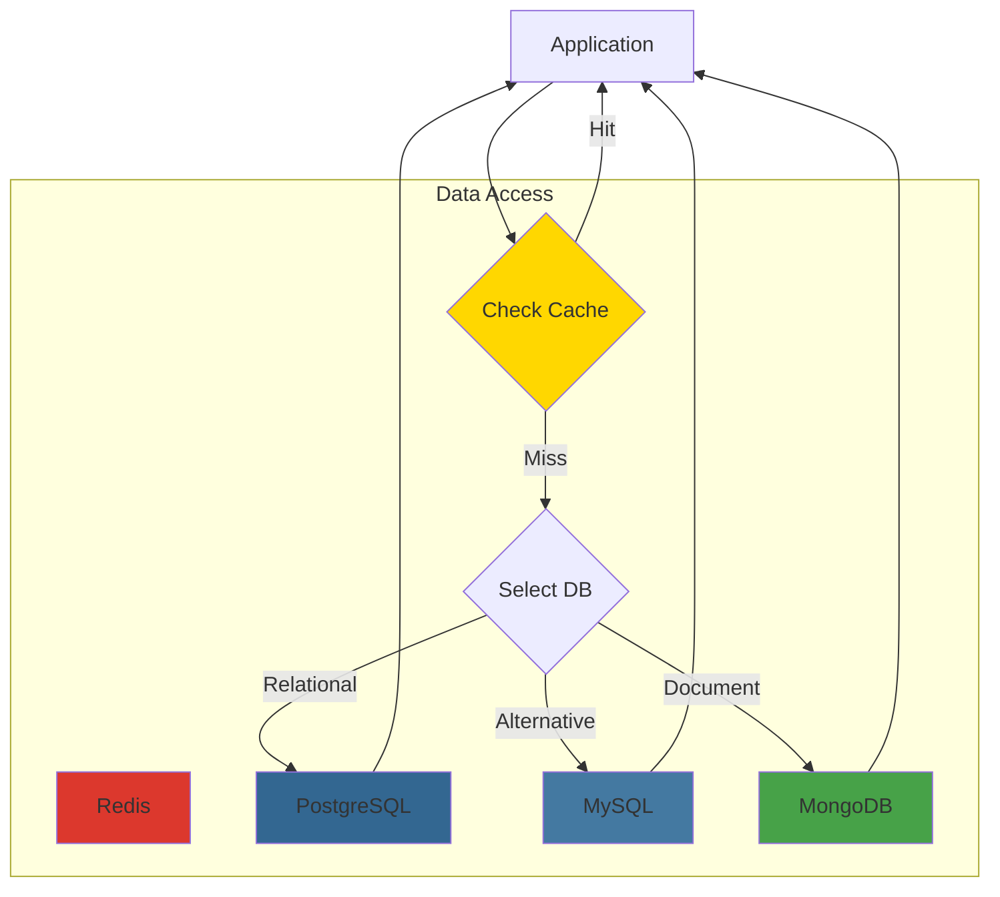
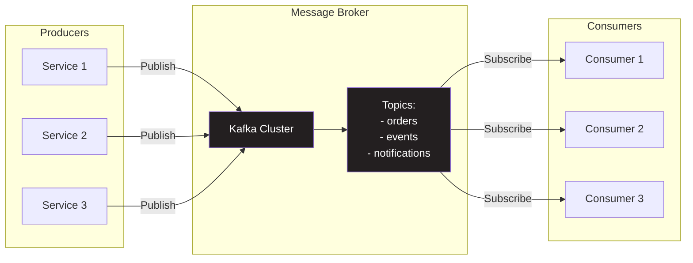
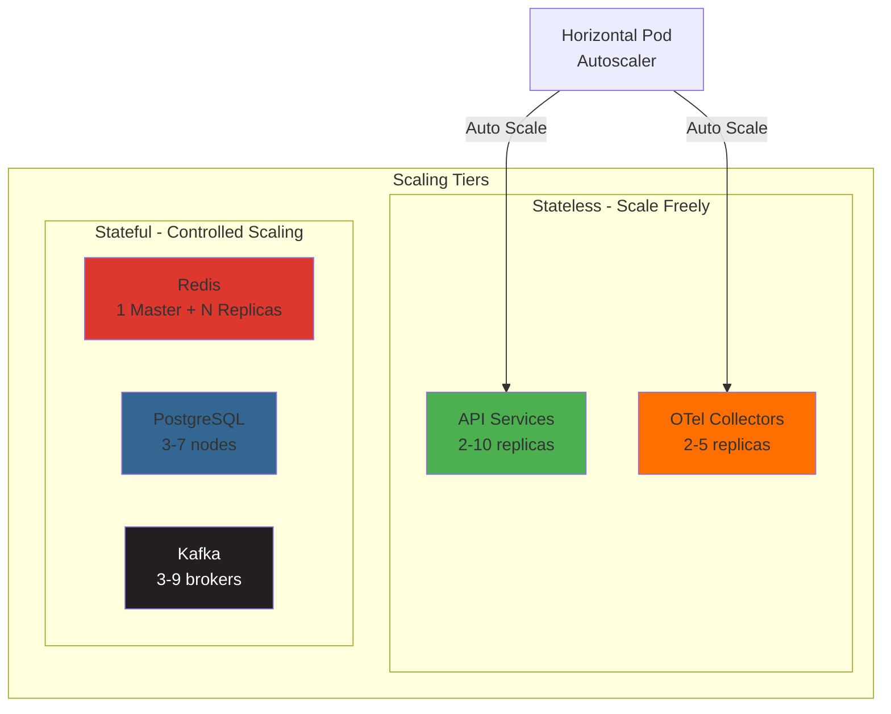
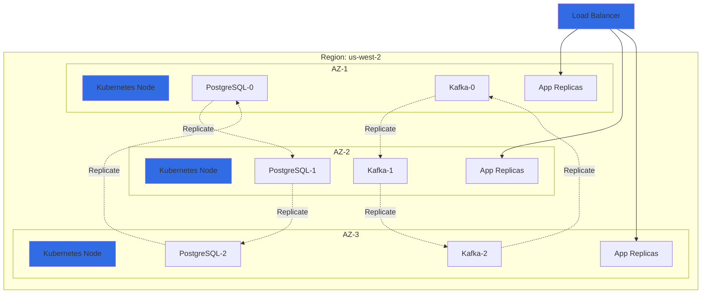
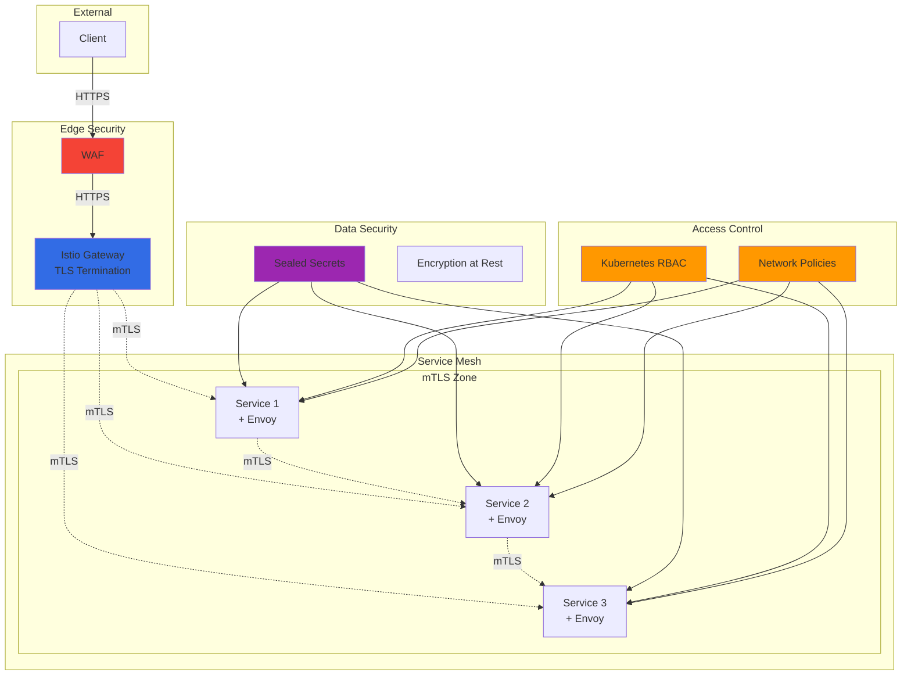
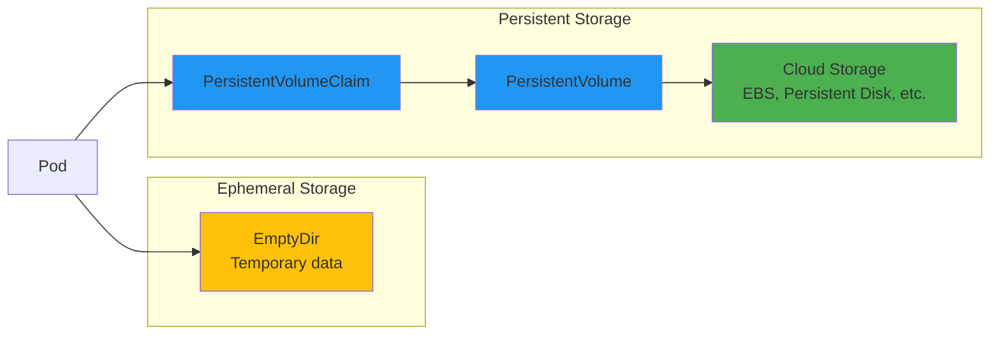

# Architecture Overview

## System Architecture

The Greenfield Cluster is built on a layered architecture that separates concerns and promotes scalability.

## High-Level Architecture

```mermaid
graph TB
    subgraph "External Layer"
        LB[Load Balancer]
        DNS[DNS]
    end
    
    subgraph "Ingress Layer"
        IG[Istio Gateway]
        subgraph "Service Mesh"
            Envoy[Envoy Proxies]
        end
    end
    
    subgraph "Application Layer"
        App1[Service 1]
        App2[Service 2]
        App3[Service N]
        FastAPI[FastAPI Example]
    end
    
    subgraph "Data Layer"
        subgraph "Caching"
            Redis[Redis<br/>Master + Replicas]
        end
        subgraph "Relational"
            PG[PostgreSQL<br/>Cluster]
            MySQL[MySQL<br/>Cluster]
        end
        subgraph "Document"
            Mongo[MongoDB<br/>Replica Set]
        end
    end
    
    subgraph "Messaging Layer"
        Kafka[Kafka<br/>Brokers]
        ZK[Zookeeper<br/>Ensemble]
    end
    
    subgraph "Observability Layer"
        OTel[OpenTelemetry<br/>Collector]
        Jaeger[Jaeger<br/>Tracing]
        Prom[Prometheus<br/>Metrics]
        Grafana[Grafana<br/>Dashboards]
    end
    
    DNS --> LB
    LB --> IG
    IG --> Envoy
    Envoy --> App1
    Envoy --> App2
    Envoy --> App3
    Envoy --> FastAPI
    
    App1 --> Redis
    App1 --> PG
    App2 --> MySQL
    App3 --> Mongo
    FastAPI --> Redis
    FastAPI --> PG
    FastAPI --> MySQL
    FastAPI --> Mongo
    
    App1 --> Kafka
    App2 --> Kafka
    App3 --> Kafka
    FastAPI --> Kafka
    Kafka --> ZK
    
    App1 --> OTel
    App2 --> OTel
    App3 --> OTel
    FastAPI --> OTel
    
    OTel --> Jaeger
    OTel --> Prom
    Grafana --> Prom
    Grafana --> Jaeger
    
    style IG fill:#326CE5
    style Envoy fill:#326CE5
    style Redis fill:#DC382D
    style PG fill:#336791
    style MySQL fill:#4479A1
    style Mongo fill:#47A248
    style Kafka fill:#231F20
    style OTel fill:#FF6F00
    style Jaeger fill:#60D0E4
    style Prom fill:#E6522C
    style Grafana fill:#F46800
```

## Network Flow

### Request Flow

### Observability Data Flow

## Component Interactions

### Database Access Pattern

### Event-Driven Architecture

## Scaling Architecture

### Horizontal Scaling

## Deployment Topology

### Multi-Zone Deployment

## Security Architecture

### Zero Trust Network

## Resource Allocation

### Resource Tiers

| Tier | CPU Request | CPU Limit | Memory Request | Memory Limit | Use Case |
|------|-------------|-----------|----------------|--------------|----------|
| Small | 100m | 500m | 128Mi | 512Mi | Collectors, sidecars |
| Medium | 250m | 1000m | 512Mi | 1Gi | Applications, APIs |
| Large | 500m | 2000m | 1Gi | 4Gi | Databases, Kafka |
| XLarge | 1000m | 4000m | 2Gi | 8Gi | Heavy workloads |

### Storage Patterns

## Design Principles

### 12-Factor App Compliance

1. **Codebase**: One codebase tracked in revision control
2. **Dependencies**: Explicitly declare and isolate dependencies
3. **Config**: Store config in the environment
4. **Backing Services**: Treat backing services as attached resources
5. **Build, Release, Run**: Strictly separate build and run stages
6. **Processes**: Execute the app as stateless processes
7. **Port Binding**: Export services via port binding
8. **Concurrency**: Scale out via the process model
9. **Disposability**: Maximize robustness with fast startup and graceful shutdown
10. **Dev/Prod Parity**: Keep development, staging, and production as similar as possible
11. **Logs**: Treat logs as event streams
12. **Admin Processes**: Run admin/management tasks as one-off processes

### Cloud Native Principles

- **Container-first**: All components containerized
- **Dynamically orchestrated**: Kubernetes manages lifecycle
- **Microservices-oriented**: Loosely coupled services
- **Observable**: Comprehensive telemetry
- **Resilient**: Self-healing and fault-tolerant
- **Declarative**: Infrastructure as code

## Next Steps

- [Deployment Methods](../deployment/methods.md)
- [Component Details](redis.md)
- [Security Overview](../security/overview.md)
