# CI/CD Integration

Learn how to integrate Greenfield Cluster with your CI/CD pipeline.

## GitHub Actions

This repository includes GitHub Actions workflows for:

1. **Kubernetes Manifest Validation** (`.github/workflows/k8s-ci.yaml`)
2. **Documentation Deployment** (`.github/workflows/docs.yaml`)

### Kubernetes CI Workflow

The K8s CI workflow runs on every push and PR:

```mermaid
graph TB
    Start[Push/PR] --> Validate
    
    subgraph "Quality Gates"
        Validate[Validate Kustomize] --> Helm[Validate Helm]
        Helm --> YAML[YAML Lint]
        YAML --> Kubeconform[Kubeconform Check]
        Kubeconform --> Security[Security Scan]
    end
    
    Security --> Success[✓ All Checks Pass]
    
    style Start fill:#4CAF50
    style Success fill:#4CAF50
    style Validate fill:#2196F3
    style Helm fill:#2196F3
    style YAML fill:#2196F3
    style Kubeconform fill:#2196F3
    style Security fill:#FF5722
```



#### What It Validates

1. **Kustomize Builds**: All base and overlays
2. **Helm Charts**: Linting and templating
3. **YAML Format**: Syntax and style
4. **Kubernetes Resources**: Schema validation
5. **Security**: Vulnerability scanning with Trivy

#### Adding to Your Project

The workflows are already included! They will run automatically on:

- Push to `main` or `develop` branches
- Pull requests to `main` or `develop`
- Changes to `kustomize/` or `helm/` directories

### Extending the CI Workflow

Add custom validation steps:

```yaml
# .github/workflows/k8s-ci.yaml
jobs:
  custom-validation:
    name: Custom Validation
    runs-on: ubuntu-latest
    steps:
      - name: Checkout
        uses: actions/checkout@v4
      
      - name: Your custom check
        run: |
          # Add your validation logic
          echo "Running custom validation"
```

## GitOps with ArgoCD

### ArgoCD Setup


Install ArgoCD:

```bash
# Create namespace
kubectl create namespace argocd

# Install ArgoCD
kubectl apply -n argocd -f https://raw.githubusercontent.com/argoproj/argo-cd/stable/manifests/install.yaml

# Access the UI
kubectl port-forward svc/argocd-server -n argocd 8080:443
```

### Create Application

```yaml
# argocd-application.yaml
apiVersion: argoproj.io/v1alpha1
kind: Application
metadata:
  name: greenfield
  namespace: argocd
spec:
  project: default
  source:
    repoURL: https://github.com/yourusername/your-greenfield-project
    targetRevision: main
    path: kustomize/overlays/prod
  destination:
    server: https://kubernetes.default.svc
    namespace: greenfield
  syncPolicy:
    automated:
      prune: true
      selfHeal: true
      allowEmpty: false
    syncOptions:
      - CreateNamespace=true
```

Apply:
```bash
kubectl apply -f argocd-application.yaml
```

### Multi-Environment Setup

Create applications for each environment:

```yaml
# argocd-apps/dev.yaml
apiVersion: argoproj.io/v1alpha1
kind: Application
metadata:
  name: greenfield-dev
spec:
  source:
    path: kustomize/overlays/dev
  destination:
    namespace: greenfield-dev
---
# argocd-apps/prod.yaml
apiVersion: argoproj.io/v1alpha1
kind: Application
metadata:
  name: greenfield-prod
spec:
  source:
    path: kustomize/overlays/prod
  destination:
    namespace: greenfield-prod
```

## FluxCD

Alternative GitOps tool:

```bash
# Install Flux
flux bootstrap github \
  --owner=yourusername \
  --repository=your-greenfield-project \
  --branch=main \
  --path=./clusters/my-cluster
```

Create Kustomization:

```yaml
# flux-kustomization.yaml
apiVersion: kustomize.toolkit.fluxcd.io/v1
kind: Kustomization
metadata:
  name: greenfield
  namespace: flux-system
spec:
  interval: 5m
  path: ./kustomize/overlays/prod
  prune: true
  sourceRef:
    kind: GitRepository
    name: flux-system
```

## Deployment Pipeline

### Complete CI/CD Flow


### Example: Complete GitHub Actions Pipeline

```yaml
name: Complete CI/CD Pipeline

on:
  push:
    branches: [main, develop]

env:
  REGISTRY: ghcr.io
  IMAGE_NAME: ${{ github.repository }}

jobs:
  build-and-push:
    runs-on: ubuntu-latest
    permissions:
      contents: read
      packages: write
    
    steps:
      - name: Checkout
        uses: actions/checkout@v4
      
      - name: Setup Docker Buildx
        uses: docker/setup-buildx-action@v3
      
      - name: Login to Registry
        uses: docker/login-action@v3
        with:
          registry: ${{ env.REGISTRY }}
          username: ${{ github.actor }}
          password: ${{ secrets.GITHUB_TOKEN }}
      
      - name: Build and Push
        uses: docker/build-push-action@v5
        with:
          context: ./apps/fastapi-example
          push: true
          tags: ${{ env.REGISTRY }}/${{ env.IMAGE_NAME }}:${{ github.sha }}
      
      - name: Update Kustomization
        run: |
          cd kustomize/overlays/dev
          kustomize edit set image fastapi-example=${{ env.REGISTRY }}/${{ env.IMAGE_NAME }}:${{ github.sha }}
          git config user.name github-actions
          git config user.email github-actions@github.com
          git add .
          git commit -m "Update image to ${{ github.sha }}"
          git push
```

## Testing in CI

### Unit Tests

Add tests to your application:

```yaml
- name: Run Unit Tests
  run: |
    cd apps/fastapi-example
    pip install -r requirements.txt
    pytest tests/
```

### Integration Tests

Test against real resources:

```yaml
- name: Integration Tests
  run: |
    # Deploy to test cluster
    kubectl apply -k kustomize/overlays/dev/
    
    # Wait for pods
    kubectl wait --for=condition=ready pod -l app=fastapi-app --timeout=300s
    
    # Run tests
    kubectl run test --image=curlimages/curl --rm -it --restart=Never \
      -- curl http://fastapi-app:8000/health
```

### End-to-End Tests

```yaml
- name: E2E Tests
  run: |
    # Deploy full stack
    kubectl apply -k kustomize/base/
    
    # Run test suite
    ./scripts/e2e-tests.sh
```

## Blue-Green Deployments

Using Istio for zero-downtime:

```yaml
apiVersion: networking.istio.io/v1beta1
kind: VirtualService
metadata:
  name: fastapi-app
spec:
  hosts:
    - fastapi-app
  http:
    - match:
        - headers:
            version:
              exact: v2
      route:
        - destination:
            host: fastapi-app
            subset: v2
    - route:
        - destination:
            host: fastapi-app
            subset: v1
          weight: 90
        - destination:
            host: fastapi-app
            subset: v2
          weight: 10
```

## Canary Deployments

Gradual rollout with Flagger:

```yaml
apiVersion: flagger.app/v1beta1
kind: Canary
metadata:
  name: fastapi-app
spec:
  targetRef:
    apiVersion: apps/v1
    kind: Deployment
    name: fastapi-app
  service:
    port: 8000
  analysis:
    interval: 1m
    threshold: 5
    maxWeight: 50
    stepWeight: 10
    metrics:
      - name: request-success-rate
        thresholdRange:
          min: 99
        interval: 1m
```

## Monitoring CI/CD

### Pipeline Metrics

Track:
- Build duration
- Test success rate
- Deployment frequency
- Lead time for changes
- Mean time to recovery

### Notifications

Add Slack notifications:

```yaml
- name: Notify Slack
  if: always()
  uses: 8398a7/action-slack@v3
  with:
    status: ${{ job.status }}
    text: 'Deployment ${{ job.status }}'
    webhook_url: ${{ secrets.SLACK_WEBHOOK }}
```

## Best Practices

1. **Test Before Deploy**: Always validate in CI
2. **Automate Everything**: Reduce manual steps
3. **Use GitOps**: Single source of truth
4. **Monitor Deployments**: Track metrics and logs
5. **Rollback Plan**: Always have a way back
6. **Security Scanning**: Scan images and manifests
7. **Environment Parity**: Keep environments similar

## Troubleshooting

### Build Failures

```bash
# Check GitHub Actions logs
gh run list
gh run view <run-id>
```

### ArgoCD Sync Issues

```bash
# Check application status
argocd app get greenfield

# Force sync
argocd app sync greenfield
```

### Rollback

```bash
# Using ArgoCD
argocd app rollback greenfield

# Using kubectl
kubectl rollout undo deployment/fastapi-app -n greenfield
```

## Next Steps

- [Security Best Practices](../security/best-practices.md)
- [Testing Guide](testing.md)
- [Contributing](contributing.md)
