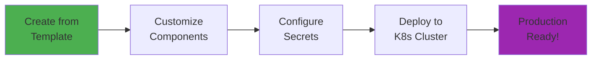
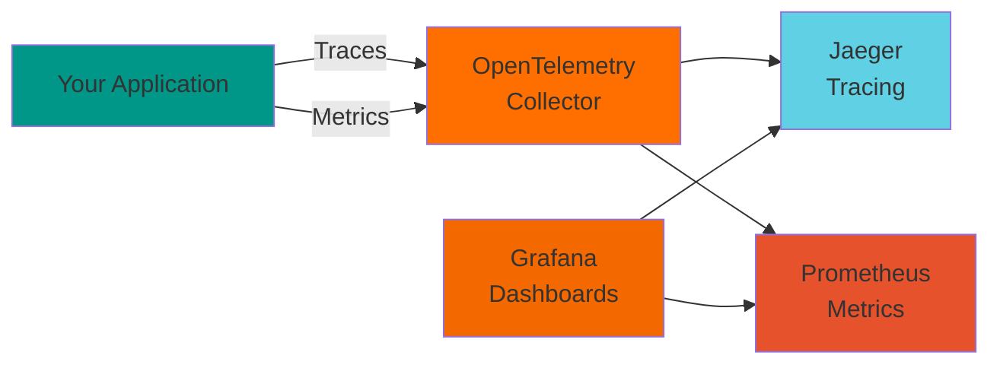

# Overview

Welcome to **Greenfield Cluster** - a production-ready Kubernetes cluster template that accelerates your journey from idea to production.

## What is Greenfield Cluster?

Greenfield Cluster is a comprehensive, pre-configured Kubernetes infrastructure stack that includes:

- 🗄️ **Multiple database options** (Redis, PostgreSQL, MySQL, MongoDB)
- 📨 **Event streaming** (Kafka with Zookeeper)
- 🔍 **Complete observability** (OpenTelemetry, Jaeger, Prometheus, Grafana)
- 🔐 **Security by default** (Istio service mesh, Sealed Secrets)
- 🚀 **Production-ready patterns** (Resource limits, health checks, scaling)
- 📦 **Example application** (FastAPI with full instrumentation)

## Why Use This Template?

### For Startups

Starting a new project? Skip months of infrastructure setup:

- ✅ Production-ready from day one
- ✅ Focus on business logic, not DevOps
- ✅ Scale as you grow
- ✅ Best practices included

### For Enterprises

Standardize your infrastructure:

- ✅ Consistent patterns across teams
- ✅ Compliance and security built-in
- ✅ Easy to audit and maintain
- ✅ Documented and tested

### For Developers

Learn Kubernetes the right way:

- ✅ Real-world examples
- ✅ Modern observability
- ✅ Cloud-native patterns
- ✅ Comprehensive documentation

## How It Works



1. **Create**: Use as GitHub template or clone directly
2. **Customize**: Remove what you don't need, add what you do
3. **Configure**: Set up secrets and environment-specific settings
4. **Deploy**: Apply to your Kubernetes cluster
5. **Scale**: Grow with your application

## Core Philosophy

### Modular Design

Every component is independent. Use what you need:

```yaml
# Want only PostgreSQL and Redis?
resources:
  - redis
  - postgres
  # - mysql      # Comment out
  # - mongodb    # Comment out
```

### Production First

No shortcuts. Everything includes:

- Resource limits
- Health checks
- Persistent storage
- Security policies
- Observability

### Cloud Agnostic

Works everywhere:

- ☁️ AWS EKS
- ☁️ Google GKE
- ☁️ Azure AKS
- ☁️ DigitalOcean Kubernetes
- 💻 On-premises
- 🖥️ Local (Minikube, Kind)

## What's Inside

### Infrastructure Layer

| Component | Purpose | Replicas |
|-----------|---------|----------|
| Redis | Caching, sessions | 1 master + 2 replicas |
| PostgreSQL | Relational data | 3 nodes |
| MySQL | Alternative RDBMS | 3 nodes |
| MongoDB | Document storage | 3 nodes |
| Kafka | Event streaming | 3 brokers |
| Zookeeper | Kafka coordination | 3 nodes |

### Observability Layer



### Service Mesh

Istio provides:

- 🔐 **mTLS**: Automatic encryption between services
- 🚦 **Traffic Management**: Intelligent routing, retries, timeouts
- 📊 **Telemetry**: Built-in observability
- 🛡️ **Security**: Authorization policies

## Deployment Options

### Kustomize (Recommended)

Best for GitOps and customization:

```bash
kubectl apply -k kustomize/overlays/prod/
```

Customize with overlays for different environments:
- `dev/` - Development with minimal resources
- `staging/` - Pre-production testing
- `prod/` - Production with full HA

### Helm

Best for parameter-driven deployment:

```bash
helm install greenfield helm/greenfield-cluster \
  --set redis.replicas=5 \
  --set postgres.storage.size=100Gi
```

## Who Is This For?

### ✅ Perfect For

- New microservices projects
- Startups building MVPs
- Teams wanting production patterns
- Learning cloud-native architecture
- Standardizing infrastructure

### ⚠️ Consider Alternatives If

- You need managed services (use cloud-native offerings)
- You have existing infrastructure (migration is complex)
- You want serverless (consider AWS Lambda, Cloud Functions)
- Single-app deployment (might be overkill)

## Getting Started

Ready to dive in?

1. **[Quick Start](quickstart.md)** - Get running in 5 minutes
2. **[Template Usage](template-usage.md)** - Create your own project
3. **[Architecture](../components/architecture.md)** - Understand the design
4. **[Deployment](../deployment/methods.md)** - Deploy to your cloud

## Example: FastAPI Application

The included FastAPI app demonstrates best practices:

```python
from fastapi import FastAPI
from opentelemetry.instrumentation.fastapi import FastAPIInstrumentor
from prometheus_client import Counter

app = FastAPI()
FastAPIInstrumentor.instrument_app(app)

REQUEST_COUNT = Counter('app_requests_total', 'Total requests')

@app.get("/")
async def root():
    REQUEST_COUNT.inc()
    with tracer.start_as_current_span("root-request"):
        return {"message": "Hello World"}
```

Features:
- ✅ Automatic OpenTelemetry tracing
- ✅ Prometheus metrics
- ✅ Database connections
- ✅ Kafka integration
- ✅ Health checks

## Community & Support

- 📖 **Documentation**: You're reading it!
- 💬 **Issues**: [GitHub Issues](https://github.com/ianlintner/green_field_cluster/issues)
- 🤝 **Contributing**: [Contributing Guide](../development/contributing.md)
- ⭐ **Star us**: Help others discover this project

## License

MIT License - Use freely in your projects!

## What's Next?

<div class="grid cards" markdown>

-   :material-clock-fast:{ .lg .middle } __Quick Start__

    ---

    Get up and running in 5 minutes

    [:octicons-arrow-right-24: Start Now](quickstart.md)

-   :material-file-document:{ .lg .middle } __Template Usage__

    ---

    Create your own project from this template

    [:octicons-arrow-right-24: Learn How](template-usage.md)

-   :material-architecture:{ .lg .middle } __Architecture__

    ---

    Understand the design and components

    [:octicons-arrow-right-24: Explore](../components/architecture.md)

-   :material-shield-check:{ .lg .middle } __Security__

    ---

    Learn about security features and best practices

    [:octicons-arrow-right-24: Secure](../security/overview.md)

</div>
