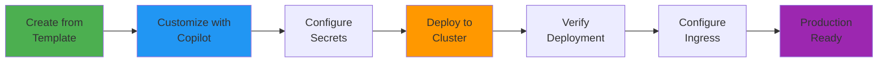

# Template Usage Guide

## Creating a New Project from This Template

This repository is designed as a **GitHub template** to bootstrap new Kubernetes-based projects quickly.

## Why Use This Template?

- ✅ Production-ready infrastructure from day one
- ✅ Best practices baked in
- ✅ Fully documented and tested
- ✅ Customizable for your needs
- ✅ AI-assisted configuration with GitHub Copilot

## Creating from Template

### Option 1: GitHub Web UI

1. Navigate to [github.com/ianlintner/green_field_cluster](https://github.com/ianlintner/green_field_cluster)
2. Click the **"Use this template"** button (green button at top right)
3. Select **"Create a new repository"**
4. Enter your project details:
   - Repository name (e.g., `my-awesome-project`)
   - Description
   - Public or Private
5. Click **"Create repository from template"**

### Option 2: GitHub CLI

```bash
gh repo create my-awesome-project \
  --template ianlintner/green_field_cluster \
  --private \
  --clone
```

### Option 3: Using `git` directly

```bash
# Clone the template
git clone https://github.com/ianlintner/green_field_cluster.git my-project
cd my-project

# Remove the original remote
git remote remove origin

# Add your new repository as remote
git remote add origin https://github.com/yourusername/my-project.git

# Push to your new repository
git push -u origin main
```

## Customization Workflow

### 1. Initial Setup

After creating your repository from the template:

```bash
cd my-project

# Update project information
# Edit these files:
# - README.md (update project name and description)
# - mkdocs.yml (update site_name, repo_url)
# - helm/greenfield-cluster/Chart.yaml (update name, description)
```

### 2. Configure with Copilot

Open your project in an IDE with GitHub Copilot enabled and describe your requirements:

!!! example "Example Copilot Prompts"
    
    **For a new SaaS application:**
    
    > "@copilot I'm building a SaaS application that needs:
    > - PostgreSQL for user data
    > - Redis for sessions
    > - Kafka for event processing
    > - Remove MySQL and MongoDB (not needed)
    > 
    > Please help me customize the cluster configuration."
    
    **For a microservices platform:**
    
    > "@copilot I need to set up this cluster for a microservices platform with:
    > - 5 microservices (auth, api, processor, notifier, analytics)
    > - Each service needs OpenTelemetry tracing
    > - PostgreSQL for each service database
    > - Kafka for inter-service communication
    > 
    > Can you help me add the manifests for these services?"

### 3. Deployment Workflow



## Common Customizations

### Remove Unused Components

If you don't need certain databases:

=== "Kustomize"

    Edit `kustomize/base/kustomization.yaml`:
    
    ```yaml
    resources:
      - namespace
      - redis
      - postgres
      # - mysql        # Commented out - not needed
      # - mongodb      # Commented out - not needed
      - kafka
      - otel-collector
      - jaeger
      - prometheus
      - grafana
      - fastapi-app
    ```

=== "Helm"

    Edit `helm/greenfield-cluster/values.yaml`:
    
    ```yaml
    mysql:
      enabled: false    # Disable MySQL
    
    mongodb:
      enabled: false    # Disable MongoDB
    ```

### Add Your Application

Create manifests for your application:

```bash
# Create your app directory
mkdir -p kustomize/base/my-app

# Add manifests
cat > kustomize/base/my-app/deployment.yaml << 'EOF'
apiVersion: apps/v1
kind: Deployment
metadata:
  name: my-app
  namespace: greenfield
spec:
  replicas: 2
  selector:
    matchLabels:
      app: my-app
  template:
    metadata:
      labels:
        app: my-app
    spec:
      containers:
        - name: my-app
          image: my-registry/my-app:latest
          ports:
            - containerPort: 8080
          env:
            - name: OTEL_EXPORTER_OTLP_ENDPOINT
              value: "http://otel-collector:4317"
            - name: DATABASE_URL
              valueFrom:
                secretKeyRef:
                  name: my-app-secret
                  key: database-url
EOF
```

### Adjust Resource Sizes

For different environments, modify the overlays:

```yaml
# kustomize/overlays/prod/kustomization.yaml
resources:
  - ../../base

replicas:
  - name: my-app
    count: 10  # Scale up for production

patches:
  - target:
      kind: Deployment
      name: my-app
    patch: |-
      - op: replace
        path: /spec/template/spec/containers/0/resources/limits/memory
        value: 2Gi
```

## Working with Copilot in Template Repos

### Best Practices for Copilot Instructions

When working with this template, use these patterns:

1. **Provide Context**: Always mention you're working with a template
   ```
   "This is a template repository for Kubernetes clusters. I need to..."
   ```

2. **Be Specific**: Describe exactly what you need
   ```
   "Add a new microservice called 'user-service' that connects to PostgreSQL"
   ```

3. **Reference Existing Patterns**: Point to similar components
   ```
   "Create a deployment similar to fastapi-app but for my Node.js API"
   ```

4. **Ask for Best Practices**: Leverage Copilot's knowledge
   ```
   "What's the best way to configure resource limits for a production database?"
   ```

### Example: Adding a New Service

!!! tip "Using Copilot to Add Services"
    
    1. Open a new file: `kustomize/base/user-service/deployment.yaml`
    
    2. Type a comment describing what you need:
       ```yaml
       # Create a deployment for a user-service that:
       # - Runs 3 replicas
       # - Connects to PostgreSQL
       # - Has OpenTelemetry instrumentation
       # - Includes health checks
       # - Has proper resource limits
       ```
    
    3. Copilot will suggest the complete manifest based on the template patterns!

## Deployment After Customization

Once you've customized your cluster:

```bash
# Validate your changes
make validate

# Deploy to development
kubectl apply -k kustomize/overlays/dev/

# Or deploy with Helm
helm install my-project helm/greenfield-cluster \
  --namespace my-project \
  --create-namespace
```

## Continuous Customization

As your project evolves:

1. **Add new components** as needed
2. **Scale resources** based on load
3. **Update configurations** for optimization
4. **Leverage Copilot** for ongoing development

## Getting Help

- Use `@copilot` in your IDE for suggestions
- Check the [Examples](../deployment/methods.md) for common patterns
- Review [Architecture](../components/architecture.md) for understanding component interactions
- See [Best Practices](../security/best-practices.md) for production guidelines

## Template Maintenance

To keep your project updated with template improvements:

```bash
# Add the template as a remote
git remote add template https://github.com/ianlintner/green_field_cluster.git

# Fetch template updates
git fetch template

# Cherry-pick or merge specific improvements
git cherry-pick <commit-hash>
```

!!! warning "Selective Updates"
    Don't blindly merge all template updates. Review changes carefully and selectively apply improvements that benefit your project.
