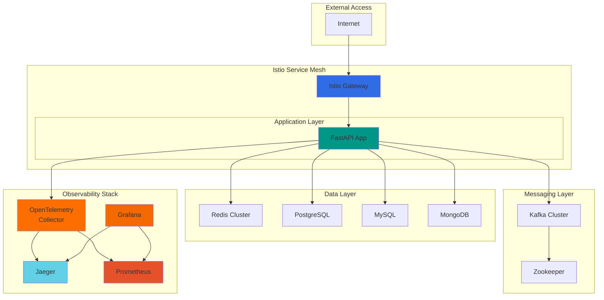

# Greenfield Cluster


## Overview

**Greenfield Cluster** is a production-ready Kubernetes cluster template designed for greenfield projects and startups. It provides a complete infrastructure stack with observability, security, and scalability built-in from day one.

## 🚀 Key Features

- **Complete Infrastructure Stack**: Redis, PostgreSQL, MySQL, MongoDB, Kafka
- **Full Observability**: OpenTelemetry, Jaeger, Prometheus, Grafana
- **Service Mesh**: Istio with mTLS and traffic management
- **Security First**: Sealed Secrets, RBAC, encryption
- **Cloud Agnostic**: Deploy to AWS, GCP, Azure, or any Kubernetes cluster
- **Template Ready**: Use as GitHub template for new projects

## 🎯 Use Cases

This template is perfect for:

- **Startups** building microservices from scratch
- **Enterprises** standardizing infrastructure
- **Teams** wanting production-ready patterns
- **Developers** learning Kubernetes best practices

## Architecture Overview



## Quick Start

Get up and running in 5 minutes:

```bash
# Clone or create from template
gh repo create my-project --template ianlintner/green_field_cluster

# Deploy everything
kubectl apply -k kustomize/base/

# Or use Helm
helm install greenfield helm/greenfield-cluster
```

## What's Included

### Infrastructure Components

| Component | Replicas | Purpose |
|-----------|----------|---------|
| Redis | 1 master + 2 replicas | Caching, sessions |
| PostgreSQL | 3 nodes | Transactional data |
| MySQL | 3 nodes | Alternative RDBMS |
| MongoDB | 3 nodes | Document storage |
| Kafka | 3 brokers | Event streaming |
| Zookeeper | 3 nodes | Kafka coordination |

### Observability Stack

| Component | Purpose |
|-----------|---------|
| OpenTelemetry Collector | Telemetry aggregation |
| Jaeger | Distributed tracing |
| Prometheus | Metrics collection |
| Grafana | Visualization |

### Example Application

A fully instrumented FastAPI application demonstrating:

- OpenTelemetry tracing
- Prometheus metrics
- Database connectivity
- Kafka integration
- Health checks

## Documentation

- [Quick Start Guide](getting-started/quickstart.md)
- [Using as Template](getting-started/template-usage.md)
- [Deployment Guide](deployment/methods.md)
- [Architecture Details](components/architecture.md)
- [Security Guide](security/overview.md)

## Contributing

Contributions are welcome! See our [Contributing Guide](development/contributing.md).

## License

MIT License - see [LICENSE](https://github.com/ianlintner/green_field_cluster/blob/main/LICENSE) for details.
