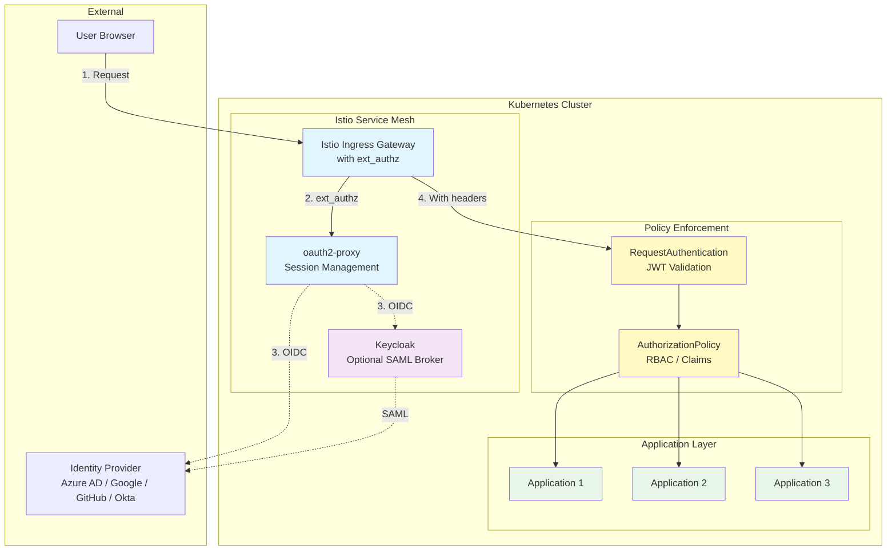
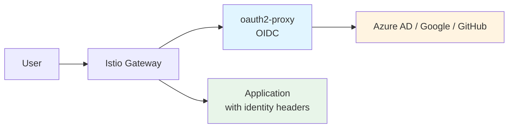
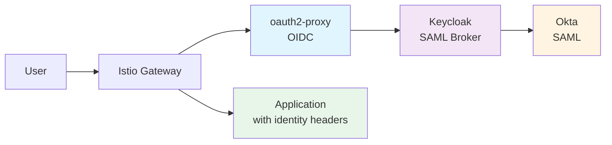
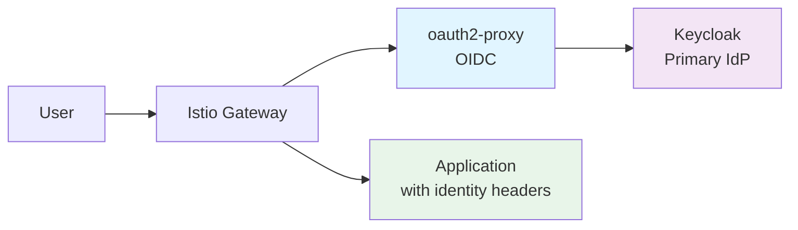
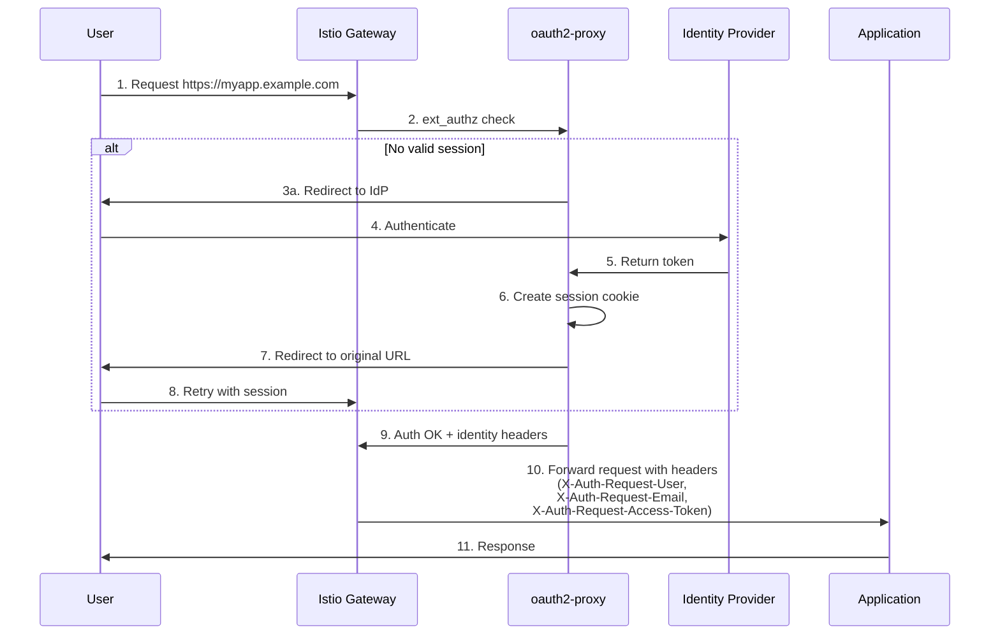
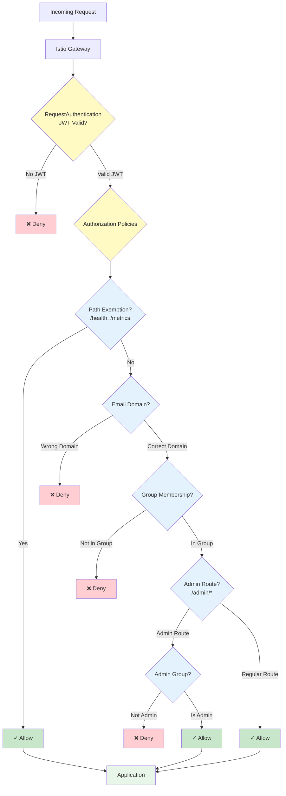

# Authentication Architecture

This document describes the modular authentication architecture for the Greenfield Cluster template.

## Overview

The authentication system provides drop-in authentication for any HTTP application with near-zero app code changes. It supports multiple identity providers (SAML, OIDC) and can be configured with different enforcement strategies.



## Architecture Principles

1. **Drop-in auth** - Applications require minimal changes to add authentication
2. **Multiple identity options** - Support SAML (Okta), OIDC (Azure AD, Google, GitHub), and Keycloak
3. **Policy + enforcement in cluster** - Authentication and authorization managed via GitOps
4. **Same workflow every time** - Consistent commands for installation and configuration

## Core Components

### oauth2-proxy

oauth2-proxy is the primary authentication proxy that:
- Handles OAuth2/OIDC authentication flows
- Manages user sessions with encrypted cookies
- Forwards identity headers to applications
- Integrates with Istio for ingress-level enforcement

### Keycloak (Optional)

Keycloak can be used as:
- **SAML to OIDC broker** - Normalizes SAML providers to OIDC
- **Primary IdP** - Platform-owned identity management
- **Federation hub** - Connects multiple external providers

### Istio Service Mesh

Istio provides:
- **Ingress gateway** - Entry point for external traffic
- **Envoy ext_authz filter** - Calls oauth2-proxy for authentication
- **RequestAuthentication** - JWT token validation
- **AuthorizationPolicy** - Fine-grained access control

## Deployment Modes

### Mode A: OIDC-first (Recommended)



**Use when:**
- Using cloud identity providers (Azure AD, Google Workspace, GitHub)
- Want fast setup with minimal components
- Don't need SAML support

**Pros:**
- Simple architecture
- Fast authentication flows
- Native JWT support
- Low resource usage

**Cons:**
- Limited to OIDC providers
- Less flexibility for custom auth flows

### Mode B: SAML-first via Keycloak



**Use when:**
- Enterprise requires SAML (Okta, OneLogin, etc.)
- Need to normalize SAML to OIDC/JWT
- Want consistent token format across providers

**Pros:**
- Supports SAML providers
- Normalizes claims/attributes
- Flexible attribute mapping
- Standard OIDC tokens for apps

**Cons:**
- Additional component (Keycloak)
- More complex setup
- Higher resource usage

### Mode C: Keycloak as Primary IdP



**Use when:**
- Platform-owned identity required
- Need complex realm/client management
- Managing service accounts
- Multiple federated providers

**Pros:**
- Full control over identity
- Service account management
- Complex authentication flows
- User federation (LDAP, AD)

**Cons:**
- Most complex architecture
- Highest resource usage
- Requires Keycloak expertise

## Enforcement Strategy

Authentication is enforced at the Istio ingress gateway using Envoy's ext_authz filter.

### Authentication Flow



### Benefits

- **No per-app sidecars** - Authentication enforced at ingress
- **Centralized logic** - Single oauth2-proxy instance
- **Uniform policies** - Consistent across all apps
- **Easy to add apps** - Simple VirtualService configuration

## Identity Claims Standardization

All providers are normalized to a standard set of claims:

```json
{
  "iss": "https://provider.example.com",
  "sub": "user-unique-id",
  "email": "user@example.com",
  "email_verified": true,
  "groups": ["developers", "admins"],
  "name": "John Doe",
  "aud": "client-id",
  "exp": 1234567890,
  "iat": 1234567890
}
```

### Claim Mapping

Different providers use different claim names. Keycloak can normalize these:

| Provider | Email Claim | Groups Claim | Notes |
|----------|-------------|--------------|-------|
| Azure AD | `email` or `preferred_username` | `groups` | Requires API permissions for groups |
| Google | `email` | N/A | Use domain restriction |
| GitHub | `email` | `teams` | Format: `org/team-slug` |
| Okta SAML | Attribute mapping | Attribute mapping | Via Keycloak broker |

## Authorization Patterns



### Pattern 1: Email Domain Restriction

Allow all users from specific email domains:

```yaml
apiVersion: security.istio.io/v1beta1
kind: AuthorizationPolicy
spec:
  action: ALLOW
  rules:
  - when:
    - key: request.auth.claims[email]
      values:
      - "*@example.com"
      - "*@partner.com"
```

### Pattern 2: Group-Based Access

Allow only specific groups:

```yaml
apiVersion: security.istio.io/v1beta1
kind: AuthorizationPolicy
spec:
  action: ALLOW
  rules:
  - when:
    - key: request.auth.claims[groups]
      values:
      - "admins"
      - "developers"
```

### Pattern 3: Path-Based Exemptions

Allow unauthenticated access to health checks:

```yaml
apiVersion: security.istio.io/v1beta1
kind: AuthorizationPolicy
spec:
  action: ALLOW
  rules:
  - to:
    - operation:
        paths:
        - "/health"
        - "/metrics"
```

### Pattern 4: Layered Policies

Combine multiple policies for defense in depth:

```yaml
# Policy 1: Allow health checks
# Policy 2: Require valid JWT
# Policy 3: Restrict to specific groups
# Policy 4: Admin-only routes
```

## Security Considerations

### Cookie Security

- **HTTPS only** - Cookies marked as Secure
- **HttpOnly** - Prevents JavaScript access
- **SameSite=Lax** - CSRF protection
- **Encryption** - Cookie contents encrypted
- **Rotation** - Regular cookie secret rotation

### Secret Management

- **Never commit secrets** - Use external-secrets or sealed-secrets
- **Strong cookie secret** - Minimum 32 bytes, randomly generated
- **Client secret rotation** - Regular rotation per provider policy
- **Namespace isolation** - Secrets scoped to namespace

### Network Security

- **TLS everywhere** - HTTPS for all external traffic
- **mTLS optional** - Internal service-to-service encryption
- **Gateway isolation** - Separate external/internal gateways
- **Rate limiting** - Protect against brute force

### Token Validation

- **JWT verification** - Signature validation with JWKS
- **Audience check** - Ensures tokens for this application
- **Expiry check** - Rejects expired tokens
- **Issuer validation** - Only trusted issuers

## Performance Characteristics

### oauth2-proxy

- **Memory**: ~50-100MB per replica
- **CPU**: ~50-100m per replica
- **Latency**: ~10-50ms per request (cached session)
- **Throughput**: ~1000 req/sec per replica

### Keycloak

- **Memory**: ~1-2GB per replica
- **CPU**: ~500-1000m per replica
- **Latency**: ~100-200ms per authentication
- **Throughput**: ~100 auth/sec per replica

### Scaling Recommendations

- **oauth2-proxy**: 2-3 replicas minimum for HA
- **Keycloak**: 3 replicas for HA, shared PostgreSQL
- **Session cache**: Redis for shared sessions (optional)

## Troubleshooting Guide

See [auth-troubleshooting.md](auth-troubleshooting.md) for detailed troubleshooting steps.

Common issues:
- Redirect loops
- Cookie domain mismatches
- JWT validation failures
- Group claims not working
- Clock skew problems

## Migration and Upgrades

### Adding Authentication to Existing Apps

1. No app code changes required
2. Add VirtualService routing through gateway
3. Apply RequestAuthentication policy
4. Apply AuthorizationPolicy rules
5. Test authentication flow

### Changing Providers

1. Deploy new provider overlay
2. Update oauth2-proxy configuration
3. Test with pilot application
4. Switch traffic gradually
5. Remove old provider

### Upgrading Components

- **oauth2-proxy**: Update image tag in deployment
- **Keycloak**: Follow Keycloak upgrade guide
- **Istio**: Update EnvoyFilter for API changes

## References

- [oauth2-proxy Documentation](https://oauth2-proxy.github.io/oauth2-proxy/)
- [Keycloak Documentation](https://www.keycloak.org/documentation)
- [Istio Security](https://istio.io/latest/docs/concepts/security/)
- [Envoy ext_authz](https://www.envoyproxy.io/docs/envoy/latest/configuration/http/http_filters/ext_authz_filter)
