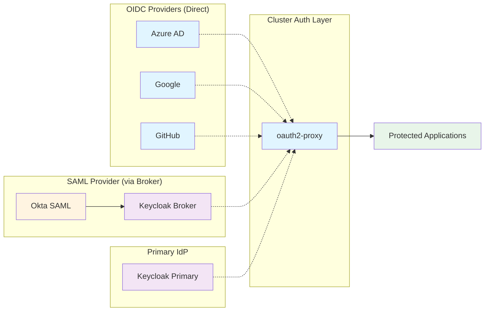
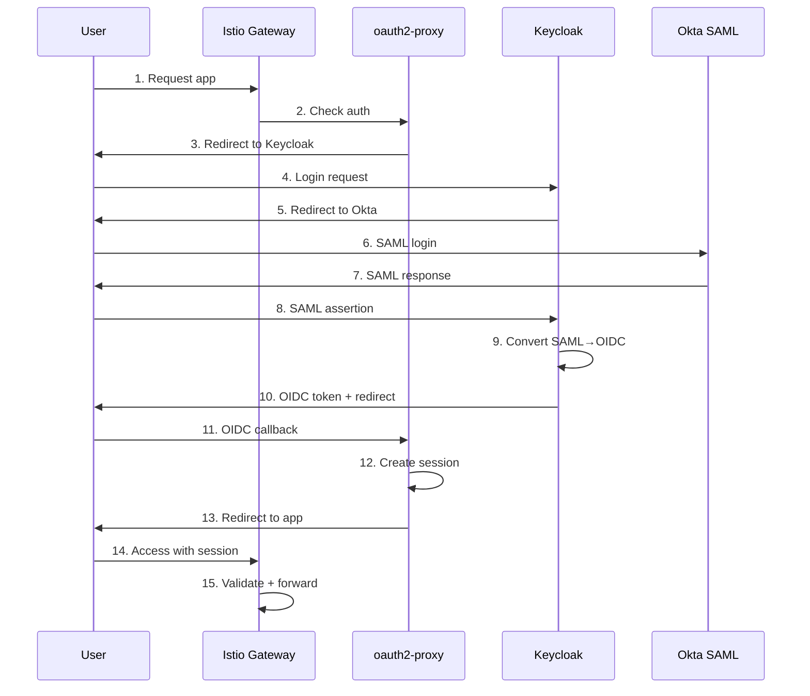

# Authentication Provider Setup Guides

This document provides setup instructions for each supported authentication provider.

## Overview

The Greenfield Cluster supports the following authentication providers:

- **Azure AD** - Microsoft Azure Active Directory (OIDC)
- **Google** - Google Workspace / Gmail (OIDC)
- **GitHub** - GitHub Organizations (OAuth2)
- **Okta** - Okta SAML via Keycloak broker
- **Keycloak** - Self-hosted identity provider



## Quick Setup Matrix

| Provider | Setup Time | Complexity | Group Support | Best For |
|----------|------------|------------|---------------|----------|
| Azure AD | 15 min | Medium | Yes (with config) | Enterprises using Microsoft 365 |
| Google | 10 min | Low | Limited | Startups using Google Workspace |
| GitHub | 5 min | Very Low | Yes (org/teams) | Developer-focused organizations |
| Okta SAML | 30 min | High | Yes | Enterprises with existing Okta |
| Keycloak | 45 min | Very High | Yes | Full control requirements |

## Azure AD Setup

### Prerequisites
- Azure AD tenant
- Admin access to create App Registrations

### Step-by-Step

1. **Create App Registration**
   ```
   Azure Portal → Azure Active Directory → App registrations → New registration
   - Name: Greenfield Cluster Auth
   - Supported account types: Single tenant
   - Redirect URI: https://auth.example.com/oauth2/callback
   ```

2. **Note Configuration Values**
   - Application (client) ID
   - Directory (tenant) ID
   - Create a client secret in "Certificates & secrets"

3. **Configure Groups (Optional)**
   ```
   App Registration → API permissions → Add permission
   - Microsoft Graph → Application permissions
   - Add: GroupMember.Read.All
   - Grant admin consent
   
   Token configuration → Add groups claim
   - Select: Security groups or All groups
   ```

4. **Deploy to Cluster**
   ```bash
   make auth.install PROVIDER=azuread DOMAIN=example.com
   
   # Create secrets
   kubectl create secret generic oauth2-proxy-secret \
     --from-literal=client-id=YOUR_CLIENT_ID \
     --from-literal=client-secret=YOUR_CLIENT_SECRET \
     --from-literal=cookie-secret=$(openssl rand -base64 32 | head -c 32) \
     -n greenfield
   ```

5. **Update Configuration**
   Edit `platform/auth/overlays/provider-azuread/configmap.yaml`:
   ```yaml
   data:
     oidc-issuer-url: "https://login.microsoftonline.com/YOUR_TENANT_ID/v2.0"
     azure-tenant: "YOUR_TENANT_ID"
   ```

### Testing
```bash
# Check deployment
kubectl get pods -n greenfield -l app=oauth2-proxy

# Test auth flow
curl -I https://myapp.example.com
# Should redirect to login.microsoftonline.com
```

### Common Issues
- Groups not in token: Check API permissions and token configuration
- Redirect loop: Verify redirect URI matches exactly
- Invalid token: Check tenant ID in issuer URL

## Google Setup

### Prerequisites
- Google Cloud Project
- Google Workspace (for group support)

### Step-by-Step

1. **Create OAuth Credentials**
   ```
   Google Cloud Console → APIs & Services → Credentials
   - Create OAuth 2.0 Client ID
   - Application type: Web application
   - Authorized redirect URIs: https://auth.example.com/oauth2/callback
   ```

2. **Note Configuration Values**
   - Client ID (ends with .apps.googleusercontent.com)
   - Client secret

3. **Deploy to Cluster**
   ```bash
   make auth.install PROVIDER=google DOMAIN=example.com
   
   # Create secrets
   kubectl create secret generic oauth2-proxy-secret \
     --from-literal=client-id=YOUR_CLIENT_ID.apps.googleusercontent.com \
     --from-literal=client-secret=YOUR_CLIENT_SECRET \
     --from-literal=cookie-secret=$(openssl rand -base64 32 | head -c 32) \
     -n greenfield
   ```

4. **Configure Domain Restriction (Optional)**
   ```bash
   kubectl set env deployment/oauth2-proxy -n greenfield \
     OAUTH2_PROXY_GOOGLE_GROUP=your-company.com
   ```

### Testing
```bash
# Check deployment
kubectl get pods -n greenfield -l app=oauth2-proxy

# Test auth flow
curl -I https://myapp.example.com
# Should redirect to accounts.google.com
```

### Common Issues
- Domain restriction not working: Check OAUTH2_PROXY_GOOGLE_GROUP environment variable
- Groups not supported: Google OIDC doesn't provide groups; use domain restriction or service account

## GitHub Setup

### Prerequisites
- GitHub Organization (for team support)
- Admin access to create OAuth Apps

### Step-by-Step

1. **Create OAuth App**
   ```
   GitHub → Settings → Developer settings → OAuth Apps → New OAuth App
   - Application name: Greenfield Cluster Auth
   - Homepage URL: https://example.com
   - Authorization callback URL: https://auth.example.com/oauth2/callback
   ```

2. **Note Configuration Values**
   - Client ID
   - Client secret

3. **Deploy to Cluster**
   ```bash
   make auth.install PROVIDER=github DOMAIN=example.com
   
   # Create secrets
   kubectl create secret generic oauth2-proxy-secret \
     --from-literal=client-id=YOUR_CLIENT_ID \
     --from-literal=client-secret=YOUR_CLIENT_SECRET \
     --from-literal=cookie-secret=$(openssl rand -base64 32 | head -c 32) \
     -n greenfield
   ```

4. **Configure Organization/Team (Optional)**
   Edit `platform/auth/overlays/provider-github/configmap.yaml`:
   ```yaml
   data:
     github-org: "your-organization"
     github-team: "team1,team2"  # Optional
   ```

### Testing
```bash
# Check deployment
kubectl get pods -n greenfield -l app=oauth2-proxy

# Test auth flow
curl -I https://myapp.example.com
# Should redirect to github.com/login/oauth
```

### Common Issues
- Organization restriction not working: Check OAUTH2_PROXY_GITHUB_ORG environment variable
- Team access denied: Ensure user is member of specified team
- Private org members: User must authorize OAuth app to access private membership

## Okta SAML Setup

### Prerequisites
- Okta account with admin access
- PostgreSQL database (included in greenfield cluster)

### Architecture

This setup uses Keycloak as a broker to convert Okta SAML to OIDC.



### Step-by-Step

1. **Deploy Keycloak**
   ```bash
   make auth.install PROVIDER=okta-saml DOMAIN=example.com
   ```

2. **Create Secrets**
   ```bash
   # Keycloak admin
   kubectl create secret generic keycloak-admin-secret \
     --from-literal=password=$(openssl rand -base64 32) \
     -n greenfield
   
   # Keycloak database
   kubectl create secret generic keycloak-db-secret \
     --from-literal=username=keycloak \
     --from-literal=password=$(openssl rand -base64 32) \
     -n greenfield
   
   # oauth2-proxy (client secret will be set later from Keycloak)
   kubectl create secret generic oauth2-proxy-secret \
     --from-literal=client-id=oauth2-proxy \
     --from-literal=client-secret=TEMPORARY \
     --from-literal=cookie-secret=$(openssl rand -base64 32 | head -c 32) \
     -n greenfield
   ```

3. **Configure Okta SAML App**
   ```
   Okta → Applications → Create App Integration
   - Sign-in method: SAML 2.0
   - App name: Keycloak
   - Single sign on URL: https://keycloak.example.com/auth/realms/master/broker/okta/endpoint
   - Audience URI: https://keycloak.example.com/auth/realms/master
   
   Attribute Statements:
   - email → user.email
   - firstName → user.firstName
   - lastName → user.lastName
   - groups → user.groups (if group support needed)
   ```

4. **Configure Keycloak**
   ```bash
   # Access Keycloak admin
   kubectl port-forward -n greenfield svc/keycloak 8080:8080
   # Open http://localhost:8080/auth
   
   # In Keycloak:
   # 1. Add Identity Provider (SAML v2.0)
   #    - Alias: okta
   #    - Service Provider Entity ID: https://keycloak.example.com/auth/realms/master
   #    - Single Sign-On Service URL: (from Okta)
   #    - Upload Okta signing certificate
   #
   # 2. Create OIDC Client
   #    - Client ID: oauth2-proxy
   #    - Access Type: confidential
   #    - Valid Redirect URIs: https://auth.example.com/oauth2/callback
   #    - Copy client secret
   #
   # 3. Configure Mappers
   #    - Add group membership mapper
   #    - Add SAML attribute mappers
   ```

5. **Update oauth2-proxy Secret**
   ```bash
   # Update with Keycloak client secret
   kubectl patch secret oauth2-proxy-secret -n greenfield \
     --type='json' \
     -p='[{"op":"replace","path":"/data/client-secret","value":"'$(echo -n KEYCLOAK_CLIENT_SECRET | base64)'"}]'
   ```

### Testing
```bash
# Check deployments
kubectl get pods -n greenfield -l app=keycloak
kubectl get pods -n greenfield -l app=oauth2-proxy

# Test auth flow
curl -I https://myapp.example.com
# Should redirect to Keycloak, which redirects to Okta
```

### Common Issues
- SAML assertion failed: Check certificate, SSO URL, Entity ID
- Groups not in token: Configure SAML attribute mapper and group mapper
- Redirect loop: Verify all URLs match (Okta, Keycloak, oauth2-proxy)

## Keycloak as Primary IdP

### Prerequisites
- PostgreSQL database (included in greenfield cluster)

### Step-by-Step

1. **Deploy Keycloak**
   ```bash
   kubectl apply -k platform/auth/overlays/keycloak-enabled/
   ```

2. **Create Secrets**
   ```bash
   kubectl create secret generic keycloak-admin-secret \
     --from-literal=password=$(openssl rand -base64 32) \
     -n greenfield
   
   kubectl create secret generic keycloak-db-secret \
     --from-literal=username=keycloak \
     --from-literal=password=$(openssl rand -base64 32) \
     -n greenfield
   ```

3. **Access Admin Console**
   ```bash
   kubectl port-forward -n greenfield svc/keycloak 8080:8080
   # Open http://localhost:8080/auth
   ```

4. **Configure Realms and Clients**
   - Create application-specific realms
   - Configure OIDC clients
   - Set up user federation (LDAP, AD)
   - Configure identity brokering

### Testing
```bash
# Check deployment
kubectl get pods -n greenfield -l app=keycloak

# Test realm availability
curl https://keycloak.example.com/auth/realms/master/.well-known/openid-configuration
```

## Next Steps

After provider setup:

1. **Protect an Application**
   ```bash
   make auth.protect APP=myapp HOST=myapp.example.com POLICY=group:developers
   ```

2. **Verify Configuration**
   ```bash
   make auth.doctor
   ```

3. **Review Documentation**
   - [Architecture](auth-architecture.md)
   - [Troubleshooting](auth-troubleshooting.md)
   - [App Templates](../../apps/templates/README.md)
