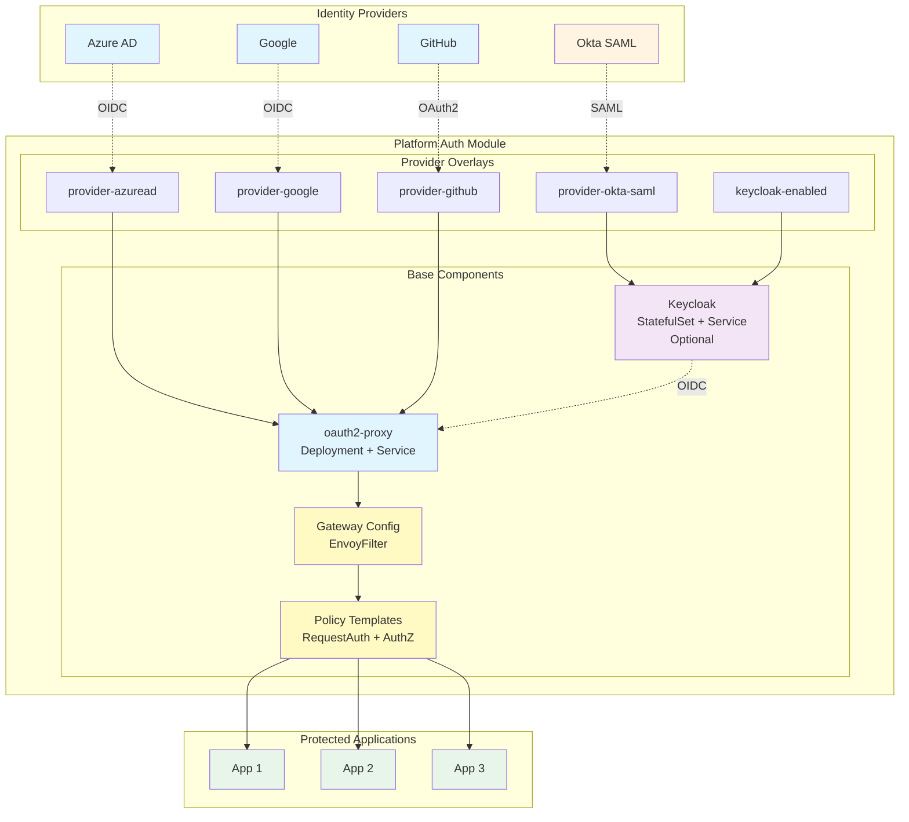

# Platform Auth Module

This module provides a modular, drop-in authentication architecture for Kubernetes clusters using oauth2-proxy, Keycloak (optional), and Istio service mesh.

## Architecture Overview



The auth module supports three deployment modes:

### Mode A - OIDC-first (Recommended Default)
- Use oauth2-proxy with OIDC providers (Azure AD, Google, GitHub)
- Direct integration with cloud identity providers
- Fast setup and widespread support

### Mode B - SAML-first (Okta)
- Use Keycloak as SAML broker → OIDC issuer
- Normalizes SAML to OIDC/JWT for cluster components
- Best for enterprises with existing SAML infrastructure

### Mode C - Keycloak as Primary IdP
- Keycloak runs in-cluster
- Federates to external providers as needed
- Platform-owned identity with complex realm management

## Components

### Base Components
- **oauth2-proxy/**: OAuth2 proxy deployment and configuration
- **gateway/**: Istio gateway integration with ext_authz
- **policies/**: RequestAuthentication and AuthorizationPolicy templates
- **keycloak/**: Optional Keycloak IdP broker

### Provider Overlays
Provider-specific configurations in `overlays/`:
- **provider-azuread/**: Azure AD OIDC configuration
- **provider-google/**: Google OIDC configuration
- **provider-github/**: GitHub OIDC configuration
- **provider-okta-saml/**: Okta SAML via Keycloak broker
- **keycloak-enabled/**: Full Keycloak deployment

## Quick Start

### 1. Install Auth Module

```bash
# Install with Azure AD
make auth.install PROVIDER=azuread DOMAIN=corp.example.com

# Install with Google
make auth.install PROVIDER=google DOMAIN=corp.example.com

# Install with Okta SAML (via Keycloak)
make auth.install PROVIDER=okta-saml DOMAIN=corp.example.com
```

### 2. Configure Secrets

Create secrets using external-secrets or sealed-secrets:

```bash
# For oauth2-proxy
kubectl create secret generic oauth2-proxy-secret \
  --from-literal=client-id=YOUR_CLIENT_ID \
  --from-literal=client-secret=YOUR_CLIENT_SECRET \
  --from-literal=cookie-secret=$(openssl rand -base64 32 | head -c 32) \
  -n greenfield
```

### 3. Protect an Application

```bash
# Protect an app with authentication
make auth.protect APP=myapp HOST=myapp.example.com POLICY=group:developers
```

## Enforcement Strategy

Authentication is enforced at the Istio ingress gateway using Envoy's ext_authz filter:

1. Request arrives at Istio ingress gateway
2. Envoy ext_authz filter calls oauth2-proxy
3. oauth2-proxy validates session or redirects to provider
4. After authentication, identity headers forwarded to app
5. Istio AuthorizationPolicy enforces group/role restrictions

### Benefits
- No per-app sidecars required
- Centralized authentication logic
- Uniform policy across apps
- Easy to add new protected services

## Directory Structure

```
kustomize/base/auth/
├── base/
│   ├── oauth2-proxy/       # OAuth2 proxy base manifests
│   ├── keycloak/           # Keycloak IdP (optional)
│   ├── gateway/            # Istio gateway + ext_authz
│   ├── policies/           # Auth policies templates
│   └── kustomization.yaml
└── overlays/
    ├── provider-azuread/   # Azure AD configuration
    ├── provider-google/    # Google configuration
    ├── provider-github/    # GitHub configuration
    ├── provider-okta-saml/ # Okta SAML via Keycloak
    └── keycloak-enabled/   # Enable Keycloak
```

## Security Best Practices

1. **Never commit plain secrets** - Use external-secrets or sealed-secrets
2. **Rotate cookie secrets** regularly (every 90 days)
3. **Use strong TLS** - Enforce TLS 1.2+ with strong cipher suites
4. **Enable HSTS** - HTTP Strict Transport Security headers
5. **Validate redirect URLs** - Restrict to known domains
6. **Monitor auth logs** - Set up alerts for failed auth attempts
7. **Implement rate limiting** - Protect against brute force attacks

## Troubleshooting

See the [troubleshooting guide](../../docs/security/auth-troubleshooting.md) for common issues:
- Redirect loops
- Cookie domain mismatches
- JWT validation failures
- Group claim mapping issues
- Clock skew problems

## Next Steps

1. Review [provider setup guides](../../docs/security/auth-providers.md)
2. Understand [app protection patterns](../../apps/templates/README.md)
3. Configure [group-based authorization](../../docs/security/auth-authorization.md)
4. Set up [monitoring and alerting](../../docs/security/auth-monitoring.md)
